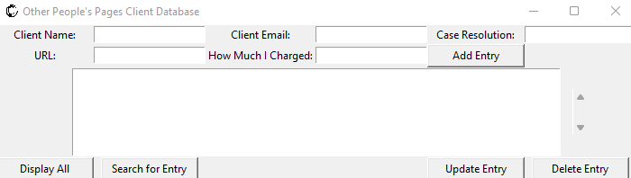
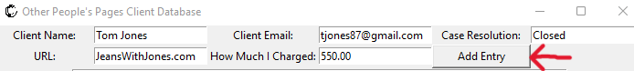
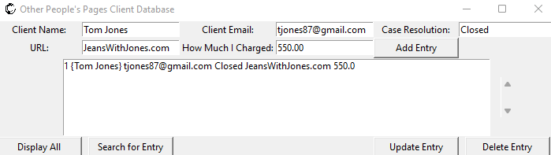
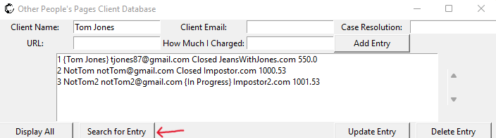
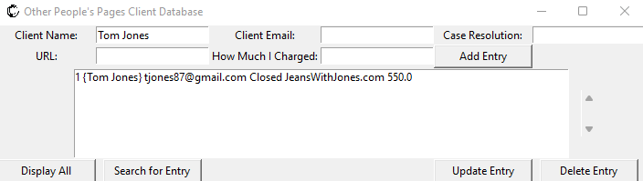

# OPP Final Product

## Brief Set of Instructions/Examples of Use for Other Peoples Pages Customer Information Database
  Most Importantly, the program can be run by running the executable inside the Executable Program Folder.
  
  The database was created by utilizing Python's Tkinter library for the GUI and SQLite3 for data storage.
  A primary goal of this design was to occupy a small portion of the screen so that the widget can remain open
  while still remaining out of the way for the client.
  
  On startup, the application looks like this:
  

Data can then be inserted into each column and added by pressing the Add Entry Button:

The entry will then be added to view field:

I will demonstrate one other function of the database application, the search. For this I have added some
other data to the database and I will pull up the previous entry by searching "Tom Jones" and hitting the Search for Entry Button:

That will then populate the view field with any matching entries, in this case that would be our original addition:

