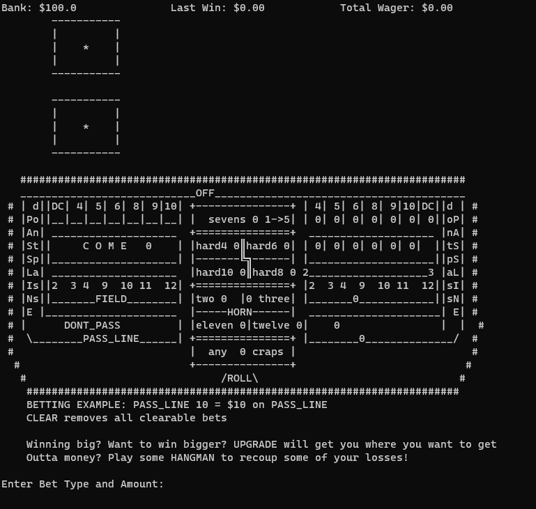
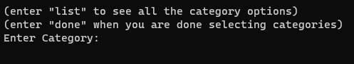

## Craps Game
### Startup:
    1. run the craps.py script using Python in the craps folder.
    2. Fullscreen your terminal window so you can see the whole board.

Side note: I could try to explain Craps but the [Venetian](https://www.venetianlasvegas.com/casino/table-games/craps-basic-rules.html)
has a much more consise summary than I could ever create.

### Game Commands:
        - "PASS_LINE" places a pass line bet
        - "DONT_PASS" places a don't pass bet
        - "FIELD" places a one time field bet
        - "COME" places a come bet
        - "FOUR" places a four bet
        - "FIVE" places a five bet
        - "SIX" places a six bet
        - "EIGHT" places an eight bet
        - "NINE" places a nine bet
        - "TEN" places a ten bet
        - "hard4" places a hardway 4 bet
        - "hard6" places a hardway 6 bet
        - "hard8" places a hardway 8 bet
        - "hard10" places a hardway 10 bet
        - "two" places a one time two bet
        - "three" places a one time three bet
        - "eleven" places a one time eleven bet
        - "twelve" places a one time twelve bet
        - "any_craps" places a one time any craps bet
        - "sevens" places a one time sevens bet
    Follow each command with the amount of money you'd you like place, 
    for example "FIELD 3.50" would place $3.50 on the field bet.
    - After bets have been placed, use the "ROLL" command to roll the dice.
    - The "UPGRADE" command will bring up the upgrade menu where you can purchase better payouts.
    - The "TEST" command will give you $100.00 to test out features, if necessary =)
    - The "HANGMAN" command is designed as a way to legitimately make money back if you go broke playing Craps, 
    and also as a failsafe in case the entire craps game wasn't a valid choice for this project...
    
### Screenshots:
Start of game:

After a bet has been placed it will show up in its corresponding location on the right side of the craps board:

After you win a bet it shows you at the top your total winnings, you can also see how much money you have in total and how much you are wagering:

## Python Scripting Project
    The orgin of my Flashcard generator/database tool for Tony Award Winners.
    To run the program, simply navigate to the Final folder and execute the setup.py in a terminal
    **with the command "python setup.py"**
    After booting up you will see this list of options,
    which can be selected by entering their respective number:
   

    Let's first talk about the Query Tools, of which there are three:
   
    
    The Show Query will take the name of a show and return a list of the award(s) said show won. 
    For example, when I put in Billy Elliot, it returns:
   
    
    The Winner and Year Queries work very similarly, just with their respective data instead.
    
    Next, let's look into the dynamic flashcard tool, which I am personally quite happy with.
    This is what greets you initially when selecting the tool:
   
    
    From here, you can enter list to pull up all the categories you can add to your flashcards:
   
    
    Once you have selected all your desired categories, you will be asked whether or not
    you'd like to shuffle the flashcards:
   
    
    Definitely mess around a bit with this tool, the array manipulation 
    took me awhile to get working properly.
    
    Lastly, there are currently two guessing games that I've setup to help with 
    memorization beyond just flashcards:
   
    
    They are not super complex games, but they do have score tracking and a highscore.
    For example, here's a prompt you would encounter in the Best Musical Guessing Game:
   
    
    Moving forward with this project I would like to add in a way to create custom datasets within the program itself. 
    That would allow the tool to be more useful to a broader audience instead of just musical theatre nerds. 
    That being said, I do feel like the flashcards and the guessing games could easily be adapted to fit many
    different datasets.
